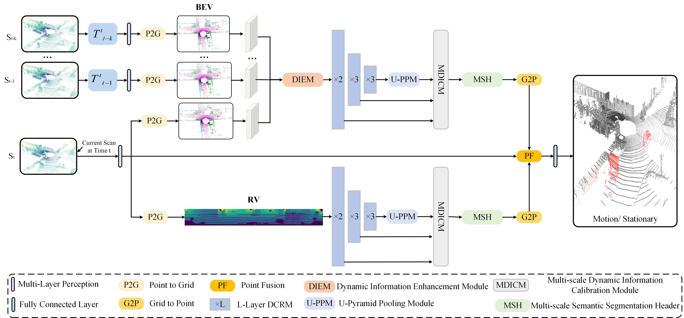

# P2DNet


Official code for P2DNet

> **Moving Object Segmentation Network for Multi-View Fusion of Vehicle-Mounted LiDAR**,
> Jianwang Gan, Guoying Zhang, Yijin Xiong.


#### 1 Dependency

```bash
CUDA>=10.1
Pytorch>=1.5.1
PyYAML@5.4.1
scipy@1.3.1
```

#### 2 Training Process

##### 2.1 Installation

```bash
cd deep_point
python setup.py install
```

##### 2.2 Prepare Dataset

Please download the [SemanticKITTI](http://www.semantic-kitti.org/dataset.html#overview) dataset to the folder `SemanticKITTI` and the structure of the folder should look like:

```
./
├── 
├── ...
└── dataset/
    ├──sequences
        ├── 00/         
        │   ├── velodyne/
        |   |	├── 000000.bin
        |   |	├── 000001.bin
        |   |	└── ...
        │   └── labels/ 
        |       ├── 000000.label
        |       ├── 000001.label
        |       └── ...
        ├── 08/ # for validation
        ├── 11/ # 11-21 for testing
        └── 21/
	        └── ...
```

And download the [object bank](https://drive.google.com/file/d/1QdSpkMLixvKQL6QPircbDI_0-GlGwsdj/view?usp=sharing) on the SemanticKITTI to the folder `object_bank_semkitti` and the structure of the folder should look like:

```
./
├── bicycle
├── bicyclist
├── car
├── motorcycle
├── motorcyclist
├── other-vehicle
├── person
├── truck
```

##### 2.3 Training Script

```bash
python3 -m torch.distributed.launch --nproc_per_node=8 train.py --config config/config_smvf_sgd_ohem_vfe_k2_fp16_48epoch.py
```

#### 3 Evaluate Process

```bash
python3 -m torch.distributed.launch --nproc_per_node=8 evaluate.py --config config/config_smvf_sgd_ohem_vfe_k2_fp16_48epoch.py --start_epoch 0 --end_epoch 47
```
